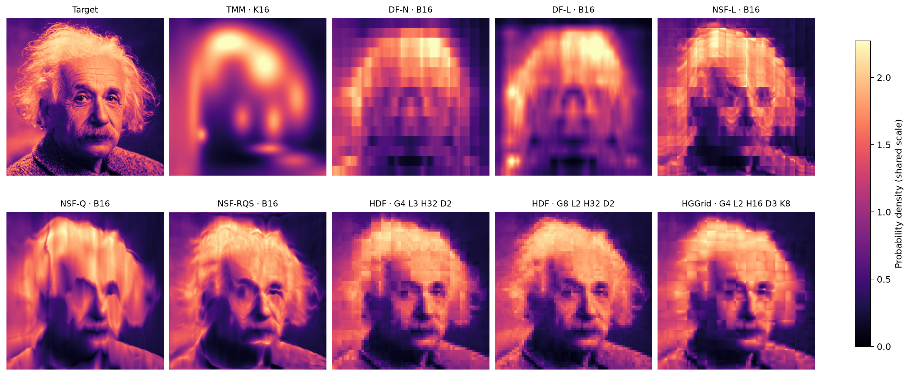
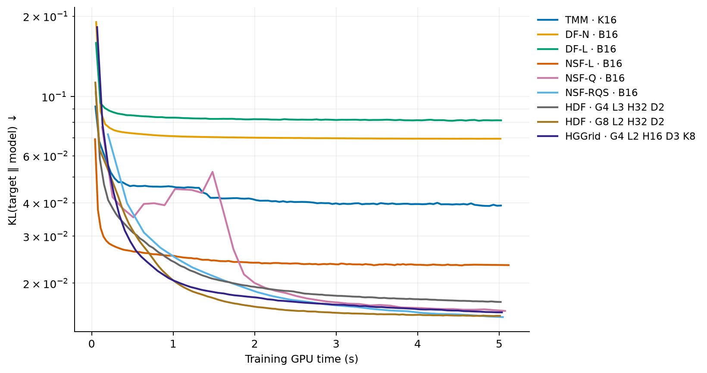
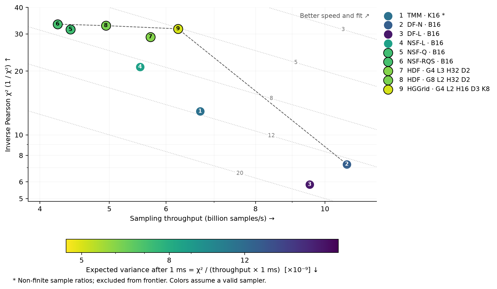

# TSNN
Neural density estimation helpers for [Slang](https://github.com/shader-slang/slang), aimed to simplify neural texture compression, neural radiance caching, neural importance sampling, etc., inspired by [tcnn](https://github.com/nvlabs/tiny-cuda-nn) and [RTXNS](https://github.com/NVIDIA-RTX/RTXNS).

This library only depends on Slang and has explicit support for [Falcor](https://github.com/nvidiagameworks/falcor) and [slangpy](https://github.com/shader-slang/slangpy)

## Advantages:
* **Cross-Platform Compatibility**: Unlike tcnn, TSNN is not tied to CUDA: Slang cross-compiles the same source to SPIR-V, DXIL, and CUDA, so the same network runs on any Vulkan or D3D12 GPU, not just NVIDIA hardware.
* **Full Kernel Fusion**: Training, optimization, and inference are each a single fused compute kernel, minimizing host/device overhead
* **Hardware Acceleration**: Natively uses Cooperative Vector Operations
* **Flexibility**: Slangs Auto-Diff system allows for arbitrary architectures and efficiently calculates gradients using Source Code Transformation

> [!WARNING]  
> Does not work for slangpy >= 0.43, because Slang v2026.12 makes CoopVec differentiable themselves, recent Slang also has [their own neural network module](https://github.com/shader-slang/slang/tree/master/source/standard-modules/neural).

## Features

### Modules
* MLPs
* Neural Spline Flows (Affine, Linear, Quadratic, RQS, Circular RQS)
* Neural Mixture Models (Histogram, truncated Gaussian, von Mises-Fisher)
* Common loss functions (L1/L2, Relative L1/L2, Relative L2 Luminance)
* Common activation functions (ReLU, Swish, LeakyReLU, etc)

### Optimizers
* Adam/AdamW

### Encodings
* Hash Grid 2D/3D
* Spherical Harmonics
* One Blob

## Documentation
The framework is built around three manually-invoked fully-fused kernel invocations:
1. Training
2. Optimization
3. Inference

The implementation of these kernels is highly problem-specific, so this repo only provides utility functions/classes.

## Benchmarks

### Image Compression vs tiny-cuda-nn
[`examples/image_learn`](examples/image_learn) fits a hash-grid + MLP to
[`examples/einstein.png`](examples/einstein.png) at 512x512 and compares
against an equivalent [tiny-cuda-nn](https://github.com/nvlabs/tiny-cuda-nn)
config (`benchmark_tcnn.py`): same encoding, network shape, batch size, and
Adam hyperparameters. Both scripts warm up (JIT-compile TSNN's Slang
pipelines / pay tcnn's one-time CUDA context and allocator init) before the
timed run.

Each of TSNN's three kernel invocations is timed separately with GPU
timestamp queries (CUDA events for tcnn), isolating device execution time
from host/Python overhead, and reported per iteration. Training and
optimizer are timed every step of the main training run; inference is timed
as a separate, dedicated back-to-back pass after training completes, since
this example trains once then infers from the fixed result (unlike an
online setup such as NRC, where training and inference interleave every
frame):

| Kernel | TSNN (Slang) | tiny-cuda-nn (JIT) | tiny-cuda-nn | vs JIT | vs plain |
|---|---|---|---|---|---|
| Training (fwd+bwd) | 488.6 us/step | 520.0 us/step | 646.5 us/step | 1.06x | 1.32x |
| Optimizer step | 504.0 us/step | 551.1 us/step | 549.9 us/step | 1.09x | 1.09x |
| Layout conversion | 8.5 us/pass | — | — | — | — |
| Inference | 81.7 us/pass | 115.7 us/pass | 197.4 us/pass | 1.42x | 2.42x |

Averaged over 5,000 training steps and 200 full-image (512x512) inference
passes, batch 16,384, RTX 5070 Ti (2026-10-01). Ratios divide tcnn time by
TSNN time (>1x = TSNN faster). Final PSNR: TSNN 53.24 dB, tcnn JIT 52.84 dB,
tcnn plain 53.04 dB. Conversion includes matrix conversion and bias copies;
converted weights are reused for inference.

### Neural Density Estimation

[`examples/ndebench`](examples/ndebench) fits the luminance distribution of
Einstein with factorized densities, spline flows, and hierarchical histograms.
HDF and HGGrid share one implementation: `K=0` gives uniform histogram leaves,
while `K>0` adds a truncated Gaussian mixture within each leaf. Configuration
labels give grid width `G`, histogram levels `L`, MLP width `H`, hidden layers
`D`, and Gaussian count `K`; `B` is the per-axis bin count.







Measured on an RTX 5070 Ti using Vulkan and SlangPy 0.42.0 (2026-10-02),
seed 42, native-resolution 3250×3259 target, batch 262,144, Adam learning rate
0.001, and five GPU seconds of training per method. Compilation, warmup and
checkpoint evaluation are excluded; inference averages 100 warmed dispatches
of 262,144 queries. All density panels share the same linear color scale.
KL and Pearson χ² use texel-center quadrature; lower χ² means lower theoretical
importance-sampling variance for the fitted PDF. The sampling plot puts
throughput and inverse χ² on the axes, so top right is best; colors and diagonal
guides show expected variance after 1 ms, `χ² / (throughput × 0.001 s)`.

DF-N is the fastest sampler in this run. HGGrid `G4 L2 H16 D3 K8` combines
5.44 billion samples/s with χ² 0.0307; NSF-RQS has the lowest χ², 0.0295.
All nine models produce finite importance ratios for every diagnostic sample.
TMM uses log-space truncated-normal sampling and is on the sampling Pareto frontier.
These measurements describe this image, budget, seed and device.

See the [numeric results](examples/ndebench/figures/summary.md),
[recorded run](examples/ndebench/figures/results.json), and
[configuration and reproduction notes](examples/ndebench/README.md).
Run `cd examples/ndebench && uv run benchmark.py` to reproduce the figures.

> [!NOTE]  
> HGGrid and HDF were developed as part of my master’s lab project; the other models are reimplementations of prior work

## Examples
For examples using [slangpy](https://github.com/shader-slang/slangpy) see the [texture compression](examples/image_learn), [neural density estimation and hierarchical Gaussian mixtures](examples/ndebench) examples.

## Falcor Usage
To use this library in Falcor just add it as a [submodule](https://git-scm.com/book/en/v2/Git-Tools-Submodules) and list it in `external/CMakeLists.txt`:
```CMake
...
add_subdirectory(tsnn)
```
The shader library will be added automatically.

## License and Citation

This framework is licensed under the BSD 3-clause license.
Please see LICENSE.txt for details.

If you use it in your research, we would appreciate a citation via

```bibtex
@software{tsnn,
	author = {Stamm, Julian},
	license = {BSD-3-Clause},
	title = {{tsnn}},
	url = {https://github.com/julcst/tsnn},
	year = {2026}
}
```
